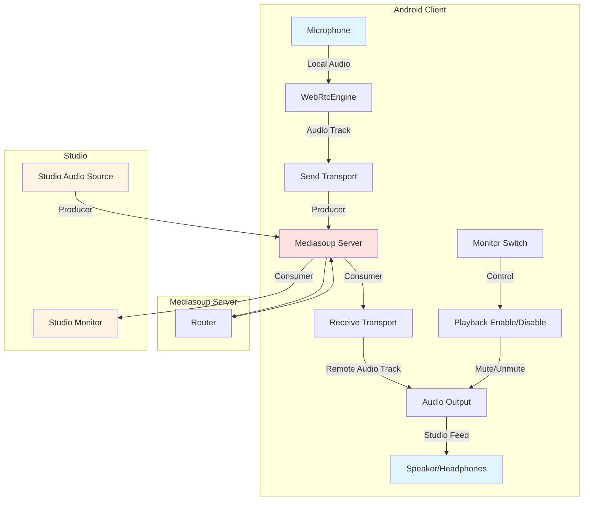

# Mix Minus and 2-Way Audio Architecture Outline

## Executive Summary

This document outlines all the updates required for Mix Minus and 2-way audio to flow correctly between the Android client and the Mediasoup server. The architecture uses individual stream routing where each listener receives the original stream directly from the broadcaster, with no server-side mixing.

## Current Architecture Analysis

### Server Architecture (Individual Stream Routing)

```
┌─────────────────────────────────────────────────────────────┐
│                     Mediasoup Server                         │
│                                                               │
│  ┌──────────────┐                                            │
│  │   Router     │                                            │
│  │              │                                            │
│  │  Producer 1  │───────┬───────┬───────┬───────┐           │
│  │  (Broadcaster)│       │       │       │       │           │
│  └──────────────┘       │       │       │       │           │
│                         │       │       │       │           │
│                    ┌────▼──┐ ┌──▼───┐ ┌─▼───┐ ┌▼────┐      │
│                    │Consumer│ │Consumer│ │Consumer│ │Consumer│   │
│                    │   1   │ │   2   │ │   N   │ │  N+1  │    │
│                    └────┬──┘ └──┬───┘ └─┬───┘ └┬────┘      │
│                         │       │       │       │           │
└─────────────────────────┼───────┼───────┼───────┼───────────┘
                          │       │       │       │
                    ┌─────▼──┐ ┌─▼───┐ ┌─▼───┐ ┌▼────┐
                    │Listener│ │Listener│ │Listener│ │Listener│
                    │   1    │ │   2   │ │   N   │ │  N+1  │
                    └────────┘ └──────┘ └──────┘ └──────┘
```

### Key Characteristics

1. **Single Producer per Broadcaster**: Each broadcaster creates exactly one producer with a unique ID
2. **Individual Consumers per Listener**: Each listener creates their own consumer for each producer they want to receive
3. **No Mixing Logic**: The server does not combine multiple producers into a single stream
4. **Independent Streams**: Each listener receives a separate stream copy
5. **Quality Preservation**: Original audio quality is maintained without transcoding or mixing

### Stream Flow

```
Broadcaster's Audio → Producer → Router → Consumer → Listener
```

Each listener receives:

- The original, unmodified audio stream from the broadcaster
- Through their own dedicated consumer connection
- With independent RTP parameters negotiated per listener

## Mix Minus Concept

### What is Mix Minus?

Mix Minus is a technique where you send audio to someone but exclude their own audio from what they receive. This prevents echo/feedback loops in broadcast scenarios.

### Why Mix Minus is Needed

In a 2-way audio scenario:

1. **Broadcaster** sends audio to **Studio**
2. **Studio** sends audio back to **Broadcaster** (for monitoring)
3. Without Mix Minus, the broadcaster would hear their own voice echoed back
4. This creates feedback loops and poor audio quality

### Mix Minus Implementation Strategy

Since the server uses individual stream routing (no mixing), Mix Minus is achieved through:

1. **Client-side Audio Routing**: The Android client controls which audio is sent and which is played back
2. **Separate Transports**: Send transport for outgoing audio, receive transport for incoming audio
3. **Playback Control**: Ability to mute/unmute the incoming studio feed without affecting the outgoing stream

## 2-Way Audio Flow

### Complete Audio Flow Diagram



### Audio Flow Steps

#### Outgoing Audio (Broadcaster → Studio)

1. **Microphone Capture** ([`WebRtcEngine.startLocalAudio()`](java/com/fm/digital/webrtc/WebRtcEngine.kt:105))
   - Audio captured from device microphone
   - Processed through WebRTC audio pipeline
   - Echo cancellation disabled (for studio use)
   - Noise suppression disabled (for studio use)

2. **Send Transport Creation** ([`MediasoupManager.createSendTransport()`](java/com/fm/digital/webrtc/MediasoupManager.kt:109))
   - Creates WebRTC PeerConnection for sending
   - Negotiates ICE/DTLS parameters with server
   - Establishes secure connection

3. **Producer Creation** ([`MediasoupManager.produceAudio()`](java/com/fm/digital/webrtc/MediasoupManager.kt:209))
   - Creates RTP transceiver with SEND_ONLY direction
   - Configures Opus codec parameters:
     - Stereo enabled
     - In-band FEC enabled
     - Max bitrate: 128kbps
   - Sends RTP parameters to server

4. **Server Routing**
   - Server creates producer from received RTP parameters
   - Producer is stored in peer's producers map
   - Server notifies all listeners about new producer

5. **Studio Consumption**
   - Studio receives `newProducer` notification
   - Studio creates consumer for this producer
   - Studio receives broadcaster's audio stream

#### Incoming Audio (Studio → Broadcaster)

1. **Producer Detection** ([`MediasoupManager.handleNewProducer()`](java/com/fm/digital/webrtc/MediasoupManager.kt:88))
   - Client receives `newProducer` message from server
   - Checks if producer kind is "audio"
   - Initiates consumption process

2. **Receive Transport Creation** ([`MediasoupManager.createRecvTransport()`](java/com/fm/digital/webrtc/MediasoupManager.kt:115))
   - Creates WebRTC PeerConnection for receiving
   - Negotiates ICE/DTLS parameters with server
   - Establishes secure connection

3. **Consumer Creation** ([`MediasoupManager.consumeRemoteProducer()`](java/com/fm/digital/webrtc/MediasoupManager.kt:121))
   - Sends `consume` message to server with producer ID
   - Server creates consumer and returns consumer ID
   - Server returns RTP parameters for consumer

4. **Consumer Resume** ([`MediasoupManager.handleConsumed()`](java/com/fm/digital/webrtc/MediasoupManager.kt:130))
   - Client sends `resumeConsumer` message
   - Server starts sending RTP packets to client
   - Audio stream begins flowing

5. **Track Reception** ([`MediasoupManager.onAddTrack()`](java/com/fm/digital/webrtc/MediasoupManager.kt:163))
   - WebRTC notifies client of new remote track
   - Client stores reference to remote audio track
   - Enables playback (if monitor is enabled)
   - Starts audio level analysis for VU meter

6. **Playback Control** ([`MediasoupManager.setPlaybackEnabled()`](java/com/fm/digital/webrtc/MediasoupManager.kt:425))
   - User can toggle studio monitor on/off
   - When disabled: track volume set to 0
   - When enabled: track volume set to 1.0
   - **This is the Mix Minus mechanism**

## Current Implementation Status

### ✅ Already Implemented

#### Client-Side (Android)

1. **MediasoupManager.kt**
   - ✅ Send transport creation and management
   - ✅ Receive transport creation and management
   - ✅ Producer creation with Opus codec configuration
   - ✅ Consumer creation and resumption
   - ✅ New producer detection and consumption
   - ✅ Remote audio track reception
   - ✅ Playback control (Mix Minus mechanism)
   - ✅ Inbound audio level monitoring for VU meter
   - ✅ Network stats monitoring (RTT)
   - ✅ ICE restart and connection recovery

2. **WebRtcEngine.kt**
   - ✅ Low-latency audio configuration
   - ✅ Stereo input/output
   - ✅ Local audio track creation
   - ✅ Audio level calculation for VU meter
   - ✅ Microphone mute control

3. **BroadcastService.kt**
   - ✅ Service lifecycle management
   - ✅ Audio focus management
   - ✅ Headset detection and routing
   - ✅ Phone call interruption handling
   - ✅ Network stats exposure
   - ✅ Inbound audio level exposure

4. **MainActivity.kt**
   - ✅ Monitor switch UI and listener
   - ✅ Studio VU meter UI and observation
   - ✅ RTT display UI and observation
   - ✅ Headset detection warning
   - ✅ Connection state management

5. **SignalingMessage.kt**
   - ✅ All required message types defined
   - ✅ Producer/Consumer messages
   - ✅ Transport messages
   - ✅ Error handling

### ❌ Server-Side Updates Needed

The server-side implementation needs to be verified and potentially updated to support:

1. **Producer Notification System**
   - Ensure `newProducer` messages are sent to all peers when a producer is created
   - Include producer ID, peer ID, and kind in notification

2. **Consumer Creation**
   - Handle `consume` requests from clients
   - Create consumer with appropriate RTP parameters
   - Return consumer ID and RTP parameters to client

3. **Consumer Resume**
   - Handle `resumeConsumer` requests
   - Start sending RTP packets to consumer

4. **Producer Cleanup**
   - Handle producer closure when peer disconnects
   - Send `producerClosed` notifications to all consumers
   - Clean up resources

## Detailed Implementation Updates

### Server-Side Updates

#### 1. Producer Creation and Notification

**Location**: `signalingServer.js` (lines 377-383)

**Current Implementation**:

```javascript
// Each broadcaster creates exactly one producer
const producer = await transport.produce({
  kind: "audio",
  rtpParameters: data.rtpParameters,
});

peer.producers.set(producer.id, producer);
```

**Required Updates**:

```javascript
// After producer creation, notify all other peers
const newProducerNotification = {
  method: "newProducer",
  data: {
    producerId: producer.id,
    peerId: peer.id,
    kind: "audio",
  },
};

// Send to all peers except the producer
peers.forEach((otherPeer) => {
  if (otherPeer.id !== peer.id) {
    otherPeer.socket.send(JSON.stringify(newProducerNotification));
  }
});
```

#### 2. Consumer Creation

**Location**: `signalingServer.js` (lines 447-451)

**Current Implementation**:

```javascript
// Each listener creates their own consumer
const consumer = await transport.consume({
  producerId: data.producerId,
  rtpCapabilities: peer.rtpCapabilities,
});
```

**Required Updates**:

```javascript
// Handle consume request
case 'consume':
  const producer = getProducerById(data.producerId);
  if (!producer) {
    socket.send(JSON.stringify({
      method: 'error',
      data: { error: 'Producer not found' }
    }));
    return;
  }

  const consumer = await peer.recvTransport.consume({
    producerId: data.producerId,
    rtpCapabilities: peer.rtpCapabilities
  });

  peer.consumers.set(consumer.id, consumer);

  // Send consumer details back to client
  socket.send(JSON.stringify({
    method: 'consumed',
    data: {
      id: consumer.id,
      producerId: data.producerId,
      kind: consumer.kind,
      rtpParameters: consumer.rtpParameters
    }
  }));
  break;
```

#### 3. Consumer Resume

**Required Implementation**:

```javascript
case 'resumeConsumer':
  const consumer = peer.consumers.get(data.consumerId);
  if (consumer) {
    await consumer.resume();
    logger.info(`Consumer ${data.consumerId} resumed`);
  }
  break;
```

#### 4. Producer Cleanup

**Required Implementation**:

```javascript
// When peer disconnects
socket.on("disconnect", () => {
  // Close all producers
  peer.producers.forEach((producer) => {
    producer.close();

    // Notify all consumers
    const producerClosedNotification = {
      method: "producerClosed",
      data: { producerId: producer.id },
    };

    peers.forEach((otherPeer) => {
      otherPeer.socket.send(JSON.stringify(producerClosedNotification));
    });
  });

  peer.producers.clear();

  // Close all consumers
  peer.consumers.forEach((consumer) => consumer.close());
  peer.consumers.clear();
});
```

### Client-Side Updates

#### 1. Producer Closed Handling

**Location**: [`MediasoupManager.kt`](java/com/fm/digital/webrtc/MediasoupManager.kt:98)

**Current Implementation**:

```kotlin
is SignalingMessage.ProducerClosed -> {
    Logger.i("$tag: Producer closed: ${message.producerId}")
}
```

**Required Updates**:

```kotlin
is SignalingMessage.ProducerClosed -> {
    Logger.i("$tag: Producer closed: ${message.producerId}")

    // Stop audio level analysis
    stopAudioLevelAnalysis()

    // Clear remote audio track reference
    remoteAudioTrack = null

    // Update UI state
    _inboundAudioLevel.value = 0
}
```

#### 2. Connection Recovery

**Location**: [`MediasoupManager.kt`](java/com/fm/digital/webrtc/MediasoupManager.kt:388)

**Current Implementation**: ICE restart and transport recreation already implemented

**Verification Needed**:

- Ensure receive transport is also recreated on connection failure
- Ensure consumer is re-created after transport recreation

#### 3. Audio Quality Monitoring

**Location**: [`MediasoupManager.kt`](java/com/fm/digital/webrtc/MediasoupManager.kt:357)

**Current Implementation**: Network stats monitoring already implemented

**Enhancement Suggestions**:

```kotlin
private fun startStatsMonitoring() {
    monitoringJob?.cancel()
    monitoringJob = scope.launch {
        while (isActive) {
            try {
                // Monitoring Outbound Network
                sendTransport?.getStats { reports ->
                    reports.statsMap.values.forEach { report ->
                        when (report.type) {
                            "remote-inbound-rtp" -> {
                                val rtt = (report.members["roundTripTime"] as? Number)?.toDouble() ?: 0.0
                                val lost = (report.members["packetsLost"] as? Number)?.toLong() ?: 0L
                                val jitter = (report.members["jitter"] as? Number)?.toDouble() ?: 0.0
                                Logger.i("Network [SEND]: RTT ${(rtt * 1000).toInt()}ms | Lost: $lost | Jitter: ${jitter * 1000}ms")
                            }
                            "outbound-rtp" -> {
                                val bytes = (report.members["bytesSent"] as? Number)?.toLong() ?: 0L
                                val packets = (report.members["packetsSent"] as? Number)?.toLong() ?: 0L
                                Logger.i("Network [SEND]: Bytes: $bytes | Packets: $packets")
                            }
                        }
                    }
                }

                // Monitoring Inbound Network (Mix-Minus)
                recvTransport?.getStats { reports ->
                    reports.statsMap.values.forEach { report ->
                        when (report.type) {
                            "remote-inbound-rtp" -> {
                                val rtt = rtpStats?.members?.get("roundTripTime") as? Double ?: 0.0
                                val rttMs = (rtt * 1000).toInt()
                                _networkStats.value = "Latency: ${rttMs}ms"

                                if (rttMs > 200) Logger.w("WARNING: High Latency in Studio Feed: ${rttMs}ms")
                            }
                            "inbound-rtp" -> {
                                val bytes = (report.members["bytesReceived"] as? Number)?.toLong() ?: 0L
                                val packets = (report.members["packetsReceived"] as? Number)?.toLong() ?: 0L
                                val lost = (report.members["packetsLost"] as? Number)?.toLong() ?: 0L
                                val jitter = (report.members["jitter"] as? Number)?.toDouble() ?: 0.0
                                Logger.i("Network [RECV]: Bytes: $bytes | Packets: $packets | Lost: $lost | Jitter: ${jitter * 1000}ms")
                            }
                        }
                    }
                }
            } catch (_: Throwable) {}
            delay(3000)
        }
    }
}
```

## Testing and Validation

### Test Scenarios

#### 1. Basic 2-Way Audio Flow

**Steps**:

1. Start Android app and connect to server
2. Verify producer is created (check logs)
3. Start studio and connect to server
4. Verify studio receives broadcaster's audio
5. Verify studio creates producer
6. Verify Android app receives `newProducer` notification
7. Verify Android app creates consumer
8. Verify Android app receives studio audio
9. Verify studio VU meter shows audio levels
10. Verify RTT display shows latency

**Expected Results**:

- ✅ Producer created successfully
- ✅ Studio receives broadcaster audio
- ✅ Studio producer detected
- ✅ Consumer created successfully
- ✅ Studio audio received
- ✅ VU meter shows levels
- ✅ RTT displays latency

#### 2. Mix Minus Verification

**Steps**:

1. Establish 2-way audio connection
2. Speak into Android microphone
3. Verify studio hears broadcaster's voice
4. Toggle monitor switch OFF
5. Verify broadcaster does NOT hear their own voice
6. Toggle monitor switch ON
7. Verify broadcaster hears studio audio

**Expected Results**:

- ✅ Studio hears broadcaster
- ✅ No echo when monitor OFF
- ✅ Studio audio heard when monitor ON

#### 3. Connection Recovery

**Steps**:

1. Establish 2-way audio connection
2. Simulate network interruption (disable WiFi)
3. Wait for connection failure
4. Re-enable network
5. Verify ICE restart attempts
6. Verify transport recreation
7. Verify consumer re-creation
8. Verify audio resumes

**Expected Results**:

- ✅ ICE restart attempted
- ✅ Transport recreated
- ✅ Consumer recreated
- ✅ Audio resumes

#### 4. Audio Quality Monitoring

**Steps**:

1. Establish 2-way audio connection
2. Monitor network stats logs
3. Verify RTT values are reasonable (< 200ms)
4. Verify packet loss is minimal
5. Verify jitter is low
6. Check for high latency warnings

**Expected Results**:

- ✅ RTT < 200ms
- ✅ Packet loss < 1%
- ✅ Jitter < 50ms
- ✅ No high latency warnings

#### 5. Headset Safety

**Steps**:

1. Establish 2-way audio connection
2. Enable monitor with earpiece
3. Verify warning toast appears
4. Plug in headset
5. Verify audio routes to headset
6. Unplug headset
7. Verify audio routes to earpiece

**Expected Results**:

- ✅ Warning shown with earpiece
- ✅ Audio routes to headset when plugged
- ✅ Audio routes to earpiece when unplugged

## Success Criteria

### Functional Requirements

- [ ] Broadcaster can send audio to server
- [ ] Studio can receive broadcaster's audio
- [ ] Studio can send audio to server
- [ ] Broadcaster can receive studio's audio
- [ ] Mix Minus prevents echo/feedback loops
- [ ] Monitor switch controls studio playback
- [ ] Studio VU meter shows audio levels
- [ ] RTT display shows network latency
- [ ] Connection recovery works correctly
- [ ] Headset safety warnings work

### Performance Requirements

- [ ] RTT < 200ms under normal conditions
- [ ] Packet loss < 1%
- [ ] Jitter < 50ms
- [ ] Audio latency < 500ms end-to-end
- [ ] Connection recovery time < 10 seconds

### Reliability Requirements

- [ ] No audio dropouts during normal operation
- [ ] Graceful handling of network interruptions
- [ ] Proper cleanup on disconnect
- [ ] No memory leaks
- [ ] Stable for 2+ hours of continuous operation

## Architecture Benefits

### Advantages of Current Architecture

1. **Simplicity**: No complex server-side mixing logic
2. **Scalability**: Router efficiently distributes streams
3. **Quality**: Original audio quality preserved
4. **Flexibility**: Easy to add/remove participants
5. **Reliability**: Independent stream paths reduce single points of failure

### Mix Minus Implementation Benefits

1. **No Echo**: Prevents feedback loops
2. **User Control**: Broadcaster controls what they hear
3. **Professional**: Standard broadcast practice
4. **Flexible**: Can be toggled on/off as needed

## Future Enhancements

### Potential Improvements

1. **Multiple Studio Feeds**: Support for multiple studio sources
2. **Audio Mixing**: Server-side mixing for complex scenarios
3. **Video Support**: Add video streaming capability
4. **Recording**: Server-side recording of streams
5. **Analytics**: Detailed audio quality metrics
6. **Adaptive Bitrate**: Dynamic quality adjustment based on network

## Conclusion

The current architecture with individual stream routing is well-suited for Mix Minus and 2-way audio scenarios. The client-side implementation is largely complete, with server-side updates needed for proper producer/consumer management and notification. The Mix Minus mechanism is achieved through client-side playback control, which is simple, effective, and follows standard broadcast practices.

### Key Takeaways

1. **Server-side**: Individual stream routing, no mixing
2. **Client-side**: Playback control for Mix Minus
3. **Separate transports**: Send and receive are independent
4. **User control**: Monitor switch toggles studio playback
5. **Quality monitoring**: RTT, packet loss, jitter tracking
6. **Connection recovery**: ICE restart and transport recreation

### Next Steps

1. Implement server-side producer/consumer management
2. Implement server-side notification system
3. Test 2-way audio flow end-to-end
4. Verify Mix Minus functionality
5. Test connection recovery
6. Validate audio quality metrics
7. Deploy and monitor in production
