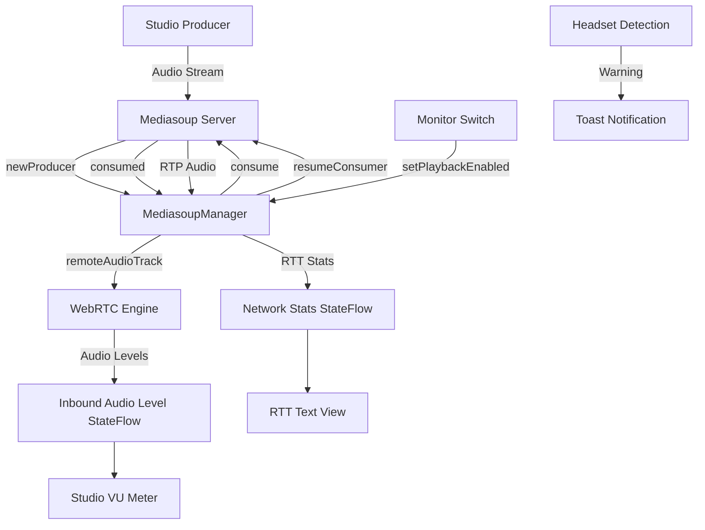

# Mix-Minus (Consumer) Path Implementation Plan

## Executive Summary

This plan outlines the remaining work needed to finalize the Mix-Minus (Consumer) path and integrate it into the UI. The core Mediasoup logic is already implemented, but the UI integration and monitoring features need to be completed.

## Current State Analysis

### ✅ Already Implemented

1. **MediasoupManager.kt** - Core Mix-Minus Logic
   - `handleNewProducer()` - Detects new producers and requests consumption (lines 82-87)
   - `handleConsumed()` - Resumes consumer after creation (lines 124-127)
   - `startStatsMonitoring()` - Monitors both send and recv transport latency (lines 318-347)
   - `setPlaybackEnabled()` - Toggles studio monitor playback (lines 386-393)
   - `networkStats` StateFlow - Exposes RTT data to UI (lines 44-45)
   - `remoteAudioTrack` - Stores received studio audio track (line 47)
   - `isPlaybackEnabled` - Tracks monitor state (line 48)

2. **activity_main.xml** - UI Components
   - Studio Monitor CardView (lines 97-144)
   - Studio VU Meter ProgressBar (lines 118-125)
   - RTT Text View (lines 127-133)
   - Monitor Switch (lines 135-141)

3. **BroadcastService.kt** - Service Integration
   - Exposes `networkStats` StateFlow from MediasoupManager (lines 64-66)
   - Manages audio routing and headset detection (lines 98-114, 244-258)

4. **SignalingMessage.kt** - Protocol Support
   - `Consume` message (lines 63-65)
   - `Consumed` message (lines 146-151)
   - `ResumeConsumer` message (lines 71-73)
   - `NewProducer` message (lines 161-165)

### ❌ Missing Implementation

1. **MainActivity.kt** - UI Integration
   - Monitor switch listener not connected
   - Network stats not observed from BroadcastService
   - RTT text view not updated
   - Studio VU meter not connected to audio data
   - Headset detection helper function missing

2. **Data Flow** - Audio Level Monitoring
   - No mechanism to measure inbound audio levels for studio VU meter
   - Need to add audio level analysis for received tracks

## Implementation Plan

### Phase 1: UI Integration in MainActivity.kt

#### 1.1 Add View References
Add the following view references to `initializeViews()`:
```kotlin
private lateinit var studioVuMeter: ProgressBar
private lateinit var rttText: TextView
private lateinit var monitorSwitch: Switch
```

#### 1.2 Add Monitor Switch Listener
Implement the monitor switch listener in `setupClickListeners()`:
```kotlin
monitorSwitch.setOnCheckedChangeListener { _, isChecked ->
    broadcastService?.mediasoupManager?.setPlaybackEnabled(isChecked)
    
    // Safety: Warn if using earpiece
    if (isChecked && !isHeadsetPlugged()) {
        Toast.makeText(this, "Caution: Using Earpiece for Monitor", Toast.LENGTH_SHORT).show()
    }
}
```

#### 1.3 Add Network Stats Observation
Add observation of network stats in a new method:
```kotlin
private fun observeNetworkStats() {
    lifecycleScope.launch {
        broadcastService?.networkStats?.collect { stats ->
            rttText.text = stats
        }
    }
}
```

Call this method in `onCreate()` after `observeMuteState()`.

#### 1.4 Add Headset Detection Helper
Add helper function to detect headset:
```kotlin
private fun isHeadsetPlugged(): Boolean {
    val audioManager = getSystemService(Context.AUDIO_SERVICE) as AudioManager
    return audioManager.isWiredHeadsetOn
}
```

### Phase 2: Studio VU Meter Integration

#### 2.1 Add Audio Level Monitoring to MediasoupManager
Add a StateFlow for inbound audio levels:
```kotlin
private val _inboundAudioLevel = MutableStateFlow(0)
val inboundAudioLevel: StateFlow<Int> = _inboundAudioLevel.asStateFlow()
```

#### 2.2 Add Audio Level Analysis
Add a method to analyze received audio levels:
```kotlin
private fun analyzeInboundAudioLevels() {
    scope.launch {
        while (isActive) {
            remoteAudioTrack?.let { track ->
                // Get audio level from WebRTC stats
                recvTransport?.getStats { reports ->
                    val audioStats = reports.statsMap.values.find { 
                        it.type == "inbound-rtp" && it.members["mediaType"] == "audio"
                    }
                    val audioLevel = audioStats?.members?.get("audioLevel") as? Double ?: 0.0
                    val level = (audioLevel * 100).toInt()
                    _inboundAudioLevel.value = level
                }
            }
            delay(100) // Update every 100ms
        }
    }
}
```

Call this method in `onAddTrack()` when the remote audio track is received.

#### 2.3 Expose Inbound Audio Level in BroadcastService
Add to BroadcastService.kt:
```kotlin
val inboundAudioLevel: StateFlow<Int>
    get() = mediasoupManager.inboundAudioLevel
```

#### 2.4 Observe Inbound Audio Level in MainActivity
Add observation in MainActivity.kt:
```kotlin
private fun observeStudioAudioLevels() {
    lifecycleScope.launch {
        broadcastService?.inboundAudioLevel?.collect { level ->
            studioVuMeter.progress = level
        }
    }
}
```

Call this method in `onCreate()` after `observeNetworkStats()`.

### Phase 3: Testing and Validation

#### 3.1 Test Mix-Minus Consumer Path
1. Start the application and connect to the server
2. Verify that when a new producer is detected, the recv transport is created
3. Verify that the consumer is created and resumed
4. Verify that the studio audio track is received and playback starts
5. Verify that the monitor switch toggles playback on/off
6. Verify that the RTT text updates with latency values
7. Verify that the studio VU meter shows audio levels

#### 3.2 Test Network Quality Monitoring
1. Verify that RTT values are displayed
2. Verify that warnings are logged when RTT > 200ms
3. Verify that the monitoring continues every 3 seconds

#### 3.3 Test Hardware Safety
1. Verify that headset detection works
2. Verify that warning is shown when monitoring with earpiece
3. Verify that audio routing switches correctly when headset is plugged/unplugged

## Architecture Diagram



## Data Flow

1. **Producer Detection Flow:**
   - Server sends `newProducer` message
   - MediasoupManager detects audio producer
   - Requests recv transport if not exists
   - Sends `consume` message to server
   - Server responds with `consumed` message
   - MediasoupManager sends `resumeConsumer` message
   - RTP audio stream starts flowing

2. **Monitoring Flow:**
   - Remote audio track received in `onAddTrack()`
   - Audio level analysis runs every 100ms
   - Inbound audio level StateFlow updates
   - MainActivity observes and updates VU meter

3. **Network Quality Flow:**
   - Stats monitoring runs every 3 seconds
   - RTT extracted from recv transport stats
   - Network stats StateFlow updates
   - MainActivity observes and updates RTT text

4. **Playback Control Flow:**
   - User toggles monitor switch
   - MainActivity calls `setPlaybackEnabled()`
   - MediasoupManager enables/disables remote audio track
   - Playback starts/stops without breaking connection

## File Changes Summary

### Files to Modify

1. **java/com/fm/digital/ui/MainActivity.kt**
   - Add view references (studioVuMeter, rttText, monitorSwitch)
   - Add monitor switch listener
   - Add network stats observation
   - Add studio audio level observation
   - Add headset detection helper function

2. **java/com/fm/digital/webrtc/MediasoupManager.kt**
   - Add inbound audio level StateFlow
   - Add audio level analysis method
   - Start audio level analysis when track received

3. **java/com/fm/digital/service/BroadcastService.kt**
   - Expose inbound audio level StateFlow

### Files Already Complete

- **java/com/fm/digital/networking/SignalingMessage.kt** - All message types defined
- **res/layout/activity_main.xml** - All UI components present
- **java/com/fm/digital/webrtc/WebRtcEngine.kt** - WebRTC engine ready
- **java/com/fm/digital/ui/ConnectionViewModel.kt** - ViewModel architecture in place

## Success Criteria

- [ ] Monitor switch toggles studio playback on/off
- [ ] RTT text displays current latency values
- [ ] Studio VU meter shows inbound audio levels
- [ ] Headset warning appears when monitoring with earpiece
- [ ] Network quality monitoring runs continuously
- [ ] Mix-Minus consumer path works end-to-end
- [ ] No audio feedback loops occur
- [ ] Connection remains stable during monitoring

## Notes

- The core Mix-Minus logic is already well-implemented in MediasoupManager.kt
- The UI components are already present in activity_main.xml
- The main work is connecting the UI to the existing logic
- Audio level analysis for inbound tracks requires WebRTC stats polling
- All changes are additive - no existing functionality needs to be modified
